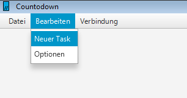

# Countodown
Countodown ist ein Taskmanagement-Tool, das die Planung und Priorisierung von Aufgaben nach zeitlichem Faktor ermöglicht - ideal für Unternehmensbereiche mit dynamischem Tagesgeschäft oder großem Planungsbedarf.

Das Tool setzt stark auf die Visualisierung von Task für den optimalen Überblick. Ein wichtiger Askpekt ist außerdem die Bündelung von Datenquellen, um zahlreiche Task-"Baustellen" zu vermeiden (Notizbuch, Jira, Mailsystem...).

## Download und Installation
Der Download von Countodown steht ausführbare Datei zur Verfügung. Diese wird bereits mit allen benötigten Bibliotheken und einer JAVA 8 JRE ausgeliefert und installiert sich beim ersten mal starten selbst.
### Windows
[Countodown-windows64-offline.exe](dist/Countodown-windows64-offline.exe)
### Linux
[Countodown-linux-64-offline.tar](dist/Countodown-linux64-offline.tar)

## Deinstallation und Installationsverzeichnis
Zum Deinstallieren von Countodown muss man nur das Installationsverzeichnis und den CountodownData Ordner löschen. Die beiden Ordner 'JWrapper-Countodown' und 'CountodownData' befinden sich unter:
### Windows
`C:\Users\USERNAME\AppData\Roaming`

Den AppData Ordner erreicht man am einfachsten wenn man: 'WindowsTaste + R' drückt, dann %appdata% in das Fenster eingibt und mit Enter bestätigt.
### Linux
`/home/USERNAME/.JWrapper`

(Unsichtbare Ordner zeigt man mit der Tastenkombination 'CTRL + H')

## Login to JIRA
Countodown bietet die Möglichkeit sich mit verschiedenen Benutzern in verschiedene JIRAs einzuloggen. Die JIRA-Adresse muss man jedoch von Hand eintragen, siehe Optionen.
Beim Klick auf Verbindungen -> Einloggen in .....   öffnet sich der Login Dialog (gemäß euren Projektzuweisungen stehen nicht alle Möglichkeiten im nachfolgenden Screenshot zur Verfügung).

Sollte der Login fehlschlagen kann dies daran liegen dass man sich vertippt hat, die Jira-Adresse nicht korrekt ist, das JIRA keinen Zugang über die Rest API erlaubt oder man sich in letzter Zeit zu oft eingeloggt hat und JIRA beim Login ein CAPTCHA-Abfrage sendet die Countodown nicht verarbeiten kann. In diesem Fall muss man sich einmal manuell auf der JIRA Seite einloggen und das CAPTCHA dort eingeben.

Nach dem Einloggen lädt Countodown alle Tickets die als Assignee den eingeloggten Benutzer haben, dies kann einige Sekunden dauern da die Rest API leider nicht sehr schnell ist und Countodown nicht cached.

## Einen lokalen Task erstellen
Um einen lokalen Task zu erstellen klickt man auf Bearbeiten -> Neuer Task.

Dadurch öffnet sich der 'Erstelle Task' Dialog. Abgesehen von der Beschreibung sind alle Felder Pflichtfelder - die 3 Arbeitszeitfelder zählen hierbei als ein Feld.

Mit Ausnahme des Titels sind alle Felder im späteren Verlauf editierbar, der Titel ist nicht editierbar und einzigartig, dies bedeutet es darf keinen anderen lokalen Task mit dem gleichen Titel geben.

## Bearbeiten, Anzeigen

Um einen Task anzuzeigen genügt ein Doppelklick auf den entsprechenden Task.

Es öffnet sich der 'Zeige Task' Dialog wenn es sich um einen JIRA Task handelt. Bei einem lokalen Task öffnet sich der 'Bearbeite Task' Dialog. Der Unterschied zwischen beiden Dialogen liegt darin, dass man JIRA-Tickets nicht direkt aus der Countodown Applikation heraus bearbeiten kann.

Wenn man sein Ticket dennoch anpassen möchte, öffnet sich durch einen Klick auf 'Bearbeiten' der Standard Browser und zeigt die entsprechende JIRA Seite an. Nach Klick auf 'OK' geht Countodown davon aus, dass man etwas verändert hat und lädt den Task neu.

Anstatt des 'Bearbeiten' Buttons hat der 'Bearbeite Task' Dialog einen 'Abschließen' Button. Dieser bietet die Möglichkeit, die Arbeit an einem Ticket endgültig zu beenden. Countodown zeigt dieses Ticket dann nicht mehr an, es wird jedoch nicht von der Platte gelöscht. Dies bedeutet, dass der Titel weiterhin vergeben ist.

## Filter
Im rechten oberen Eck befindet sich der Button 'Filter'. Ein Klick auf Filter öffnet das Filter-Menü.

Dieses Menü besteht aus 3 Modulen: dem 'Tasks Laden' Button, dem Standard Filter und je einem JIRA Filter pro eingeloggter Benutzer/JIRA Kombination.

### Standard Filter
Im Standard Filter kann man das Anzeigedatum einstellen, das heißt man kann sich ansehen welche Tasks zu einem bestimmten Datum gerade aktuell sind - standardmäßig ist dies 'Heute'. Die maximale Fälligkeit gibt an, dass nur Tasks mit einem maximalen Fälligkeitsdatum von X angezeigt werden. Alle anderen werden ausgeblendet. Standardmäßig ist hierfür der letzte Tag eingeblendet für den es eine Farbregel gibt.

### JIRA Filter
Der JIRA Filter bietet die Möglichkeit sich beliebige Suchen zusammen zu bauen, dabei ist jedoch nur ein UND-Konkatenation möglich. Alle Suchoptionen findet man hier: https://confluence.atlassian.com/display/JIRA061/Advanced+Searching . Wenn man eine Suche startet die nicht den von JIRA vorgegebenen Bedingungen entspricht, erscheint eine Fehlermeldung (siehe unten).

## Optionen
Countodown hat mehrere Einstellungsmöglichkeiten, die man über Bearbeiten -> Optionen erreicht.

### Farboptionen
In den Farboptionen kann man Farben einem relativen Datum zuordnen. Die Farben gelten immer bis zum Ende des relativen Datums. Das Datum ist immer relativ zu 'Heute'.

Wenn man den Farb/Datums Kombinationen einen Anzeigenamen zuordnet, so kann man sie im Standardfilter als Datum auswählen. Wenn einem Datum keine Farbe zugeordnet ist, wird die Farbe ROT benutzt.

Eine Besonderheit der Farb Optionen sind Woche und Monat, diese werden kalendarisch berechnet. 1W, also eine Woche, bedeutet Sonntag dieser Woche, während 2W, also zwei Wochen, den letzten Tag der nächsten Kalenderwoche meint. Wenn wir also eine Woche eintragen so ist die Gültigkeit der Farbe für alle Tasks mit einem relativen Fälligkeitsdatum in dieser Woche.

Ich nenne es relatives Fälligkeitsdatum da es das Fälligkeitsdatum weniger dem Aufwand ist. Dies bedeutet wenn ein Task ein Fälligkeitsdatum von Übermorgen hat, er aber noch eine Arbeitszeit von einem Tag hat, so ist das relative Fälligkeitsdatum morgen. Der Task hätte dann, den Beispielfarben nach, die Farbe Orange.

Der Countodown Prototyp geht dabei davon aus, dass man sowohl Samstag als auch Sonntag arbeitet. Sollten zwei Farbregeln auf ein Fälligkeitsdatum zutreffen, so wird diejenige angewandt die weiter oben in der List steht. Die List wird absteigend sortiert, zuerst nach Monat, dann nach Woche und zuletzt nach Tag.

### JIRA-Optionen
In den JIRA Optionen können beliebig viele JIRAs eingetragen werden, wenn das JIRA nicht existiert, bzw die Adresse 'https://adresse/jira' nicht gefunden wird (Code: 404) wird eine Warnung angezeigt und der Speichervorgang wird abgebrochen.

### Sprachoptionen
Countodown bietet drei Möglichkeiten zur Sprachauswahl: Deutsch, Englisch und Systemsprache. Letzteres ist die Standard-Einstellung. Sollte die Standard-Systemsprache weder Deutsch noch Englisch sein, so gibt es einige Elemente die von Java selbst stammen und übersetzt werden, der Rest wird in Englisch angezeigt. Sollte man die Sprache seit dem letzten Start von Countodown geändert haben, so wird eine Meldung angezeigt, dass man Countodown erst neu starten muss damit die Änderungen in Kraft treten.

## Logout von JIRA
Um sich aus JIRA auszuloggen, klickt man auf Verbindung -> UserName von JIRAName ausloggen. Wenn man in mehreren JIRAs eingeloggt ist, stehen je eine Zeile pro Nutzer/JIRA Kombination. Des weiteren loggt man sich beim Schließen von Countodown automatisch aus allen JIRAs aus.

Nach dem Ausloggen wird neu geladen und alle Tasks sowie der JiraFilter aus der soeben ausgeloggten Verbindung verschwinden.
